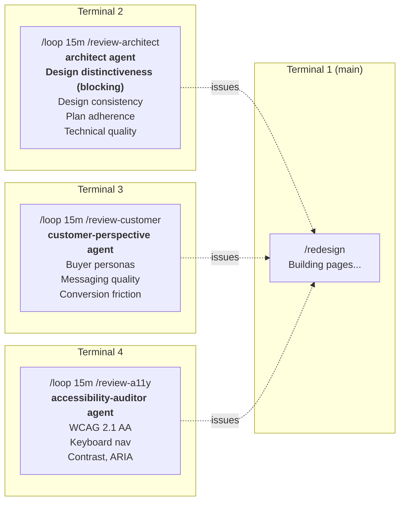
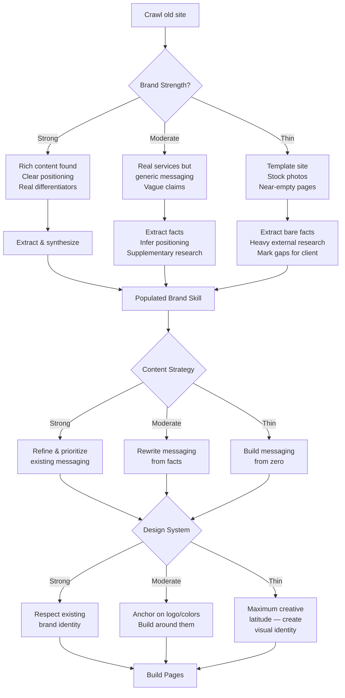
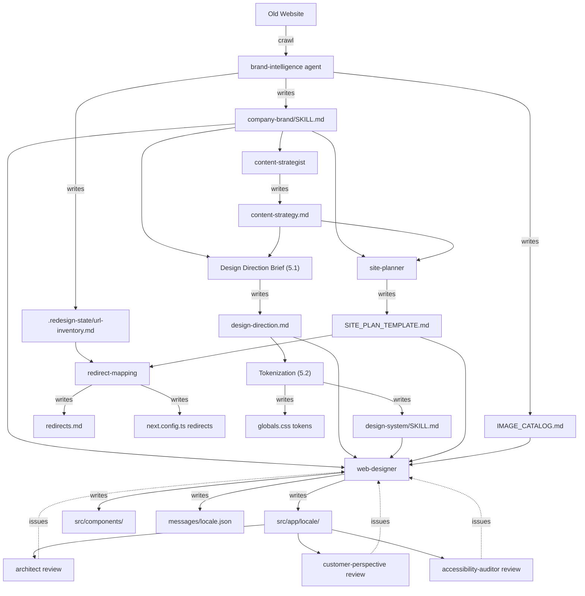

# Website Redesign Kit — Flow Diagram

## Full Pipeline

```mermaid
flowchart TD
    Start(["/redesign"]) --> R0["Step 0: Resumption Check<br/>Read state files → determine starting step"]

    R0 --> S1

    subgraph DISCOVER["DISCOVER & PLAN"]
        S1["Step 1: Brand Intelligence<br/><b>brand-intelligence agent</b><br/>(reads analyze-existing-site runbook)<br/>Crawl old site → extract identity<br/>Assess brand strength<br/>Download images + capture screenshots<br/>Write URL inventory to .redesign-state/"]
        S1 --> S2

        S2["Step 2: Content Strategy<br/><b>content-strategist agent</b><br/>Messaging hierarchy<br/>Content gap analysis<br/>Tone calibration"]
        S2 --> S3

        S3["Step 3: Site Planning<br/><b>site-planner agent</b><br/>Evaluate scope → decide pages<br/>Keywords, phases, SEO clusters"]
        S3 --> S4

        S4["Step 4: Redirect Mapping<br/><b>redirect-mapping skill</b><br/>Old URLs → new URLs<br/>Generate next.config.ts redirects"]
    end

    S4 --> S5a

    subgraph BUILD["DESIGN & BUILD"]
        S5a["Step 5.1: Design Direction Brief<br/><b>design-system skill</b><br/>Selects strategies from visual-vocabulary.md<br/>(T/C/L/P/S/D/M + Avoid list)<br/>→ design-direction.md"]
        S5a --> S5b
        S5b["Step 5.2: Tokenization<br/><b>design-system skill</b><br/>Execute the direction into tokens<br/>→ globals.css + design-system skill body"]
        S5b --> S6

        S6["Step 6: Build Pages<br/><b>web-designer agent</b> (per page)<br/>Uses /frontend-design for UI"]

        S6 --> P0["Phase 0: Shared Components<br/>Header, Footer, Nav, Breadcrumbs, CTA"]
        P0 --> BV0["npm run build ✓"]
        BV0 --> P1["Phase 1: Core Pages<br/>Homepage, Services, Contact"]
        P1 --> BV1["npm run build ✓"]
        BV1 --> P2["Phase 2: Trust & Evidence<br/>Case Studies, About"]
        P2 --> BV2["npm run build ✓"]
        BV2 --> P3["Phase 3: Legal<br/>Privacy, Cookies, Consent"]
        P3 --> BV3["npm run build ✓"]
    end

    BV3 --> S7

    subgraph VALIDATE["VALIDATE"]
        S7["Step 7: Final Review<br/><b>architect</b> + <b>customer-perspective</b><br/>+ <b>accessibility-auditor</b><br/>Apply critical fixes"]
        S7 --> S8

        S8["Step 8: Content Audit<br/>Grep [NEEDS:] markers<br/><b>web-designer</b> drafts replacements<br/>Report remaining gaps"]
        S8 --> S9

        S9["Step 9: SEO Validation<br/><b>seo-patterns skill</b> as checklist<br/>Meta, schema, headings, links<br/>Sitemap, redirects, canonicals"]
        S9 --> S10

        S10["Step 10: Production Readiness<br/>Forms, consent, security, a11y<br/>Performance, analytics, legal<br/>Redirects verified"]
    end

    S10 --> S11["Step 11: Publish<br/><b>/publish command</b><br/>npm run build → commit → push<br/>Vercel deploys automatically"]

    S11 --> Done(["Live"])
```

## Review Loop Architecture (parallel with Build)

## Skill & Agent Read Map

A graph doesn't work here — too many connections. Use this matrix instead:

| Skill ↓ / Agent → | content-strategist | site-planner | web-designer | architect | customer-perspective | a11y-auditor |
|---|:---:|:---:|:---:|:---:|:---:|:---:|
| **company-brand** | ✓ | ✓ | ✓ | ✓ | ✓ | |
| **page-design** | ✓ **W** | ✓ | ✓ | | | |
| **page-content** | ✓ | ✓ | ✓ | | | |
| **design-system** | | | ✓ | ✓ | | ✓ |
| **seo-patterns** | | | ✓ | ✓ | | |
| **conversion-opt** | | | ✓ | | ✓ | |
| **performance** | | | ✓ | ✓ | | |
| **analytics** | | | ✓ | | | |
| **legal** | | | ✓ | | | ✓ |
| **redirect** | | | | | | |

✓ = reads / **W** = writes to / `redirect-mapping` is executed directly by the orchestrator

## Brand Strength Adaptation

## Data Flow

